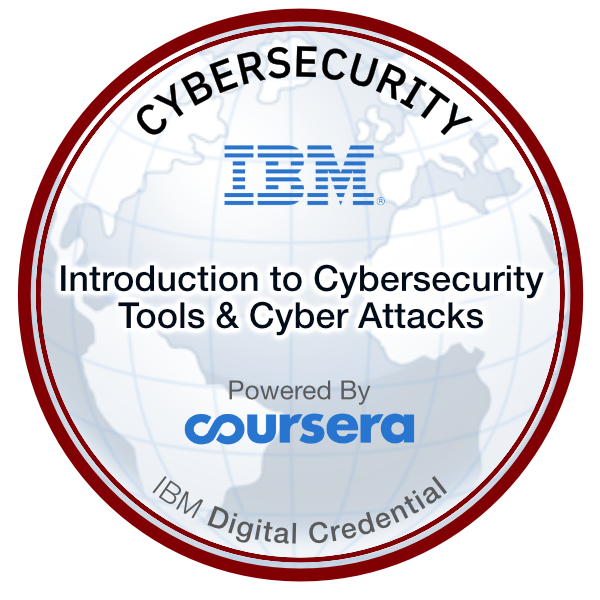

  

  

    
  

<h1 align="center">
  (T3) <b>T</b>echnical <b>T</b>hinking <b>T</b>inkerer 💭
</h1>

* 👂 Shakespeare says “What's in a name”.
* 💻 I am a Self-Taught CyberSecurity Researcher, Junior Pentester and a Programmer.
* 🌱 Currently learning and honing my skills in Bug Bounty, <a href=https://tryhackme.com/path/outline/redteaming>Red Teaming</a> and <a href="https://www.osintdojo.com/resources/">OSINT</a> to become a well-rounded security professional 
* 🤝 Quick Learner & Non-Complacent
* 💼 A Content Creator. Passionate to teach others.
* 🕵️ Truth Explorer in the Sea of Deception. 
* 📫 How to reach me: Drop your questions on any social media [(Please don't say just hi/hello)](https://nohello.net/en/)
* ❤️ I love to create & play mind boggling puzzles
* ⚡ Fun fact: Once I created a VBScript virus to pop up CD-Rom and display a message on the screen (*for Educational Purposes*). 

### Some Certifications

</a>

<a href='https://www.linkedin.com/in/pakcyberbot/details/certifications/'>More Certifications...</a>

### Some Skills (*Click to check the Resources*)
#### Graphics Designing

#### Programming

### CyberSecurity

### 📺 Latest YouTube Videos
<!-- YOUTUBE:START -->
- [OSINT Investigation Challenge - Real World Scenario](https://www.youtube.com/watch?v=IJLBVZjMFlw)
- [Building a Cyber Playground: My CTF Pentesting Lab Environment Overview](https://www.youtube.com/watch?v=TXNuUfIWZI4)
- [Cybersecurity Quest: My 365 Days on TryHackMe | My Hacking Journey](https://www.youtube.com/watch?v=LMRTXYwrd48)
- [why everyone wants an easy life ?](https://www.youtube.com/watch?v=7XYokT2eC3o)
- [Buffer Overflow Automation in Python | PakCyberbot](https://www.youtube.com/watch?v=3nSAHeJ2YpQ)
<!-- YOUTUBE:END -->
### 📕 Latest Blog posts
<!-- BLOG-POST-LIST:START -->
- [Private Investigator Walkthrough](https://infosecwriteups.com/private-investigator-walkthrough-e99b859a463c?source=rss-e78c7ba25f94------2)
- [My Experience with the Free Google Cloud Security Engineer Professional Certification](https://pakcyberbot.medium.com/my-experience-with-the-free-google-cloud-security-engineer-professional-certification-5b3d795dcd01?source=rss-e78c7ba25f94------2)
- [Level Up! My Evolving Cybersecurity Skillset in Year 2](https://pakcyberbot.medium.com/level-up-my-evolving-cybersecurity-skillset-in-year-2-d398350055c2?source=rss-e78c7ba25f94------2)
- [RunZero Coin Challenge Solution](https://pakcyberbot.medium.com/runzero-coin-challenge-solution-22ad56c835e6?source=rss-e78c7ba25f94------2)
- [Cybersecurity Quest: My 365 Days on TryHackMe](https://systemweakness.com/cybersecurity-quest-my-365-days-on-tryhackme-c99f7f0cca0f?source=rss-e78c7ba25f94------2)
<!-- BLOG-POST-LIST:END -->

  
📊GitHub Stats

  <table>
    <tr>
      <td align="center" style="padding=0;width=50%;">
        
      </td>
      <td align="center" style="padding=0;width=50%;">
        
      </td>
    </tr>
  </table>

  

  
🏆GitHub Trophies

  

<h1 align="center"> ⏰شكرا على وقتك</h1>

